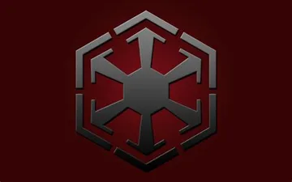

# Starcademy (Sith Academy on Korriban)
  
## Map
  

## Summary
In this game you go through the sith academy on Korriban and try to prove yourself worthy to your sith Lord Zash.  
  
There is a functioning Inventory, NPC's, different Item's changing dialogue   

You start by waking up in your bedchambers with a fellow acolyte in the room. There is multiple items you have to bring to different npc's. You can also try and go down a even darker path by trying to kill npc's although some might prove to difficult to defeat.  
At the end of it all you either died due to your own incompetence, or succeded and are on your way to Dromundkas, the sith capital.  
  
Characters and some actions might be similar to the MMORPG "Star Wars the Old Republic" because it was inspired by that game. 